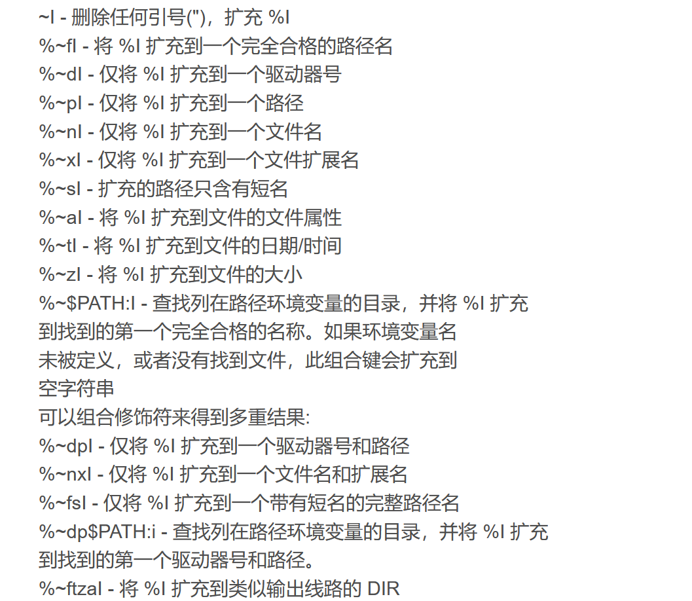

# DOS脚本编程入门

### Win-Dos环境操作
https://blog.csdn.net/m0_56799642/article/details/130651409

### DOS基础操作
https://www.jianshu.com/p/0ad2ef0cb7a1

### 一些练习
https://zhuanlan.zhihu.com/p/636010424

## call

当你在主脚本中直接调用另一个脚本（即不使用 call 命令）时，被调用的脚本会替换当前正在执行的脚本，这意味着主脚本的执行将被中断，并且不会返回到主脚本的继续执行。

## 脚本变量char* args[] 、 赋值操作

%0 批处理文件本身
%1 第一个参数
...
%9 第九个参数

### 赋值

命令：`set keya=value`
<strong><font color=red>切记`key=value`三者之间绝对不能出现空格</font></strong>，不能为了像遵守java风格擅自给添加上空格，这与java的`int a=1`声明变量不同，
<strong><font color=red>切记变量使用`%key%`</font></strong>


### 赋值方式

在批处理脚本中，对于简单的参数传递，将 `%*` 赋值给一个变量，无论是否使用引号，通常不会产生太大影响。这是因为在这种情况下，<strong><font color=red>参数之间的空格会被保留为参数字符串的一部分。</font></strong>


以下两种方式都可以将所有参数赋值给一个变量：

```bat
set allArgs=%*
```
```bat
set "allArgs=%*"
```
在这两种情况下，`%*` 都会被扩展为一个包含所有参数的字符串，并存储在 `%allArgs% `变量中。

### 常用

- 临时设置环境变量，原来的环境变量后加上英文状态下的分号和路径
`set PATH=%PATH%;C:\Users\zhangsan\Documents\winrar-x64-580`
- setx 永久设置环境变量
> 建议执行一次, 防止多试重复添加, 该威力巨大.目前不知道怎么删除单项环境变量, 只能采取重新赋值的方式
`setx PATH "%PATH%;D:\Program Files"`

## setlocal ENABLEDELAYEDEXPANSION（延迟扩展）

使用 % 进行变量扩展，例如 `%var%`。在一行代码被解析和执行之前，所有的变量都会被替换为其对应的值。
延迟扩展使用 ! 符号进行变量扩展，例如 `!var!`。这样，当脚本执行到包含延迟扩展的代码时，才会解析并替换变量为其对应的值。

## [字符串操作](https://blog.csdn.net/xiaoding133/article/details/39253083)

字符串切割：`"allArgs=!allArgs:~1!"`、`"allArgs=!allArgs:~2,-6!"`
字符串替换：`allArgs:* ="`、`set "aa=%aa:中国=中华人民共和国%"`
字符串合并:两个变量放在一起就可以了： `set str1=%str1%%str2%` 、 `set str1=%str1% %str2%` 挨不挨在一起都是可以的。

### 字符串扩展

引用于for /?帮助信息。其中的I代表变量I，不过需要说明的是，不是所有的变量都能够进行扩充的，有两个条件：
    1、该字符串代表一个文件路径；
    2、变量要用%x来表示，x可取a-z A-Z 0-9共62个字符中的任意一个。
举例说明：



## `for %%i in () do ()` 用法
切记：每个指令之间必须以空格隔开，in 与 ( 之间有空格，do 与 （ 间也有空格，否则命令会无法成功执行

### 遍历文件：
`for %%variable in (fileset) do command`

在这种用法中，`fileset` 可以是一个文件名模式（例如 `*.txt`），也可以是一个具体的文件列表。`for` 命令将根据 `fileset` 中的文件列表逐个执行 `command`。

在 `for` 循环内部，`%%variable` 是一个循环变量，可以根据需要命名。每次迭代，`%%variable` 将被设置为当前文件的值。

例如，以下示例将遍历当前目录下的所有 `.txt` 文件，并打印每个文件的名称：

``` bat
for %%f in (*.txt) do (
    echo %%f
)
```

### 遍历字符串：
`for %%variable in (set) do command`

在这种用法中，`set` 是一个字符串列表，可以是用空格或逗号分隔的多个字符串。

在 `for` 循环内部，`%%variable` 是一个循环变量，可以根据需要命名。每次迭代，`%%variable` 将被设置为 `set` 中的一个字符串。

例如，以下示例将遍历一个字符串列表，并打印每个字符串：

``` bat
for %%s in (apple orange banana) do (
    echo %%s
)
```

### 遍历数字范围：
`for /L %%variable in (start,step,end) do command`

在这种用法中，`start` 是起始值，`step` 是步长，`end` 是结束值。`for` 命令将从起始值开始，以指定的步长递增或递减，直到达到或超过结束值为止。

在 `for` 循环内部，`%%variable` 是一个循环变量，可以根据需要命名。每次迭代，`%%variable` 将被设置为当前的数字值。

例如，以下示例将从 1 到 10 遍历数字，并打印每个数字：

``` batch
for /L %%n in (1,1,10) do (
    echo %%n
)
```

### 参数

`/d`：遍历当前路径的文件夹下的文件夹，但也可在(匹配符)中指定路径
`/r` [路径]：深度遍历指定路径下的所有文件，子目录中的文件也会被遍历到，如果没指定路径，默认当前路径
`/l` ：当使用参数 `/l` 时，需结合(匹配符)一起使用，此时 () 括号内部的用法规则为：(start, step, end)，此时的 for 命令作用等同于 java 语言中的 for 语句
`/f` ：用于解析文件中的内容，本节不做介绍

## 控制语句--if

1、`if [not]"参数" == "字符串"`

2、`if [not] exist 文件名 待执行的命令`

3、`if [not] errorlevel 数字 待执行的命令：`


```bat
@echo off

REM 模拟一个返回错误级别为 2 的命令
dir nonexistent_folder

REM 检查错误级别是否小于 3
if not errorlevel 3 (
    echo 错误级别小于 3
) else (
    echo 错误级别大于等于 3
)
```

## 脚本返回值

DOS 程序运行时都会返回一个数字给 DOS，称为错误码 `errorlevel` 或称返回码,数字取值范围 0~255。 `errorlevel` 是一个特殊的变量，用于表示最近执行的命令的错误级别。
如果返回码大于或者等于（或者小于，使用 `NOT` ）指定的数字，则条件成立，运行命令，否则运行下一句。
默认值为 0，一般命令执行出错会设 `errorlevel` 为1。
判断时值的排列顺序应该由大到小，否则会出现非期望的结果。

`exit /b %returnVal%`：返回的通常是数值，不是字符串。不通过exit返回变量不会被保存在原来环境里面。

那，如何在脚本中输出字符串并将其传递给调用脚本？使用 `echo` 命令输出该字符串，使用 `exit /b` 命令退出。然后去捕获脚本的输出，在调用脚本时使用重定向进行操作。


## 模拟while循环

```bat
@echo off

set i=1
:loop
echo "i:"%i%
if %i% EQU 6 (
    goto :out
)
set /a i+=1
goto :loop

:out
```

这个就相当于

```cpp
int i=1;
while(i<6){
    printf("%d\n",i);
    ++i;
}
```

从这个角度看过去，dos脚本语言很像是汇编语言.在批处理中 > 和 < 为重定向符号，这就意味着我们不能用 > 来表示大于，< 表示小于，也就意味着不能用 >=、<=、<> 来表示大于等于、小于等于、不等于，还好，在批处理中用了其他的操作符代替它们，这些在"if /?"中有。
>   EQU - 等于;
>   NEQ - 不等于;
>   LSS - 小于;
>   LEQ - 小于或等于;
>   GTR - 大于;
>   GEQ - 大于或等于

## 系统函数 

### `pause`
`pause` 就是暂停命令，`pause > null` 的作用是同样的，区别是不显示“请按任意键继续. . .”这些字，nul 相当于空设备。

### `clip`
`clip` 将内容复制到剪切板
`clip < 1.txt`
`dir` 组合 `clip` 的用法示例： `dir | clip`

### `start` 
`start` 可以打开文件夹，文件，网址等
`start /max 1.txt`
`start /min 1.txt`

## sleep快速实现

[one](/DOS/practice/sleep.bat)
[two](/DOS/practice/sleep2.bat)
sleep 还有另外一种方法，使用 python -c 参数，如sleep 3秒：
python -c "import time; time.sleep(3)"

## dos获取键盘输入

```bat
@echo off

set /p var="please input :"  
echo %var%
```

## 标签、函数

尽管标签和函数有一些相似之处（例如接受参数并执行一系列操作），但它们之间存在一些重要的区别：

函数可以返回一个值，而标签不能。
-   函数可以在需要时被多次调用，而标签只能被调用一次。
-   函数可以在脚本中的任何地方定义，并可以在需要时进行重用，而标签只能在脚本的顶部或中间定义，并且只能在定义之后的地方调用。
-   函数可以包含局部变量（使用 `setlocal` 和 `endlocal` 命令），而标签中定义的变量是全局的。

尽管如此哦，这个东西还是远比他看上去要重要，借由这个观点，DOS可以直接编程类比C语言编程。

说到最后，批处理脚本通常用于简单的任务和自动化脚本，没有正规的函数。

```bat
@echo off

rem 主程序
echo 主程序开始
call :myFunction 123 "Hello, world!"
echo 主程序结束
pause
exit /b 0

rem 子程序
:myFunction
echo 子程序开始
echo 参数1：%1
echo 参数2：%2
echo 子程序结束
exit /b 0
```


